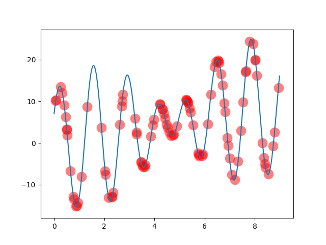
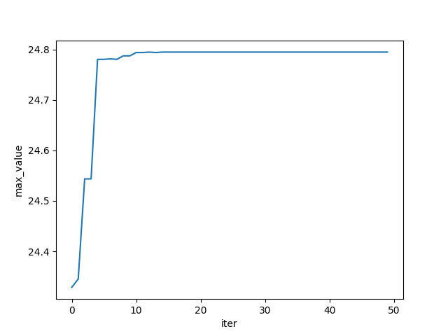
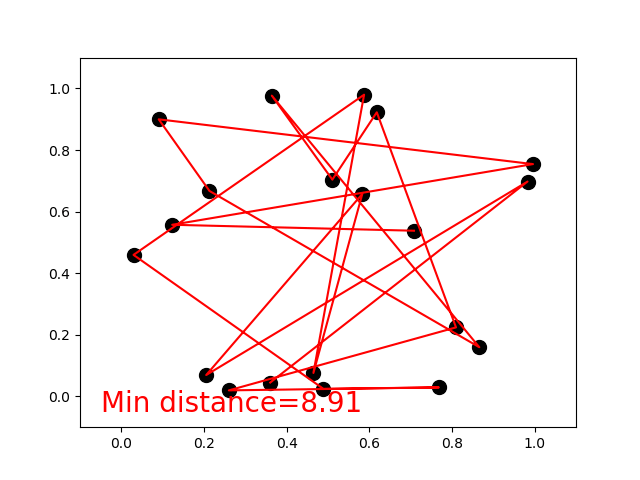
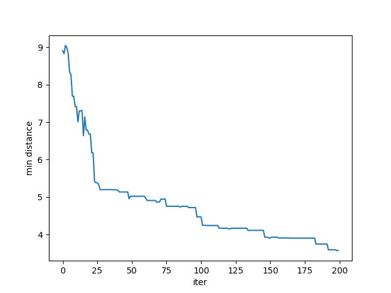

# Genetic-Algorithm
Some examples of Genetic Algorithm.

## Find max point of a function

### Description

Find out the point of the function *f(x)=x+10sin(5x)+7cos(4x)* having max value in the range [0, 9].

You can easily define you own function and other parameters.

### Visual Results

convergence curse:

### Reference

[Morvan's tutorial](https://morvanzhou.github.io/tutorials/machine-learning/evolutionary-algorithm/2-01-genetic-algorithm/)

[sjyan's answer](https://morvanzhou.github.io/tutorials/machine-learning/evolutionary-algorithm/2-01-genetic-algorithm/)

## Travelling salesman problem

### Description

Find the shortest path for Travelling salesman problem.

### Visual Results

convergence curse:

### Reference

[Morvan's tutorial](https://morvanzhou.github.io/tutorials/machine-learning/evolutionary-algorithm/2-03-genetic-algorithm-travel-sales-problem/)

